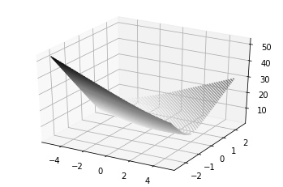
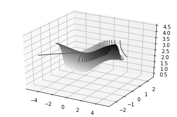

# markdown에서 자주 쓸 문법들을 정리하였다.

# Heading
- 앞에 (여러개의) #로 시작하여 Heading을 지정한다. #의 개수가 많아질수록 Heading의 크기는 작아진다.
- 언더바( _ ) 3개를 입력하여 추가적인 라인을 그릴 수 있다.

___

### 글씨 꾸미기
2개의 * = **bold**
> **bold**

1개의 * = *italic*
> *italic*

2개의 ~ = ~~strikethrough~~
> ~~strikethrough~~

- 위의 인용구(quote)는 '>'를 이용하여 생성한다.

___
### List
- 앞에 '*, -, +'로 시작하거나 '1.(숫자형)'로 시작하면 된다.

1. aaa
2. bbb
3. ccc

> 1. aaa
> 2. bbb
> 3. ccc 

___
### Code Block
- Code Block을 표현하는 방식은 여러가지가 있다.

1. 들여쓰기
> This is a normal paragraph:

>     This is a code block.
    
> end code block.

2. 구문 `<pre> <code> {code} </code> </pre>` 방식

<pre>
<code>
public class BootSpringBootApplication {
  public static void main(String[] args) {
    System.out.println("Hello, Honeymon");
  }

}
</code>
</pre>

3. 코드블럭코드(` ``` `), ` ``` `오른쪽에 사용하는 언어를 입력하면 된다(python, java, c++ etc)
> ```java
> public class BootSpringBootApplication {
>   public static void main(String[] args) {
>     System.out.println("Hello, Honeymon");
> }
> }
> ```

___

### Hyperlink

Link: [링크 키워드(title)][실제 주소가 기록된 링크]   
or   
Link: [링크 키워드(title)](실제 주소가 기록된 링크)   
or   
* 외부링크: <http://example.com/>   
* 이메일링크: <address@example.com>   

___
### Image


###### 사이즈 조절 방식
</img><br/>
</img>

___
### 줄바꾸기
- 마지막 구역에서 3칸 이상 띄어쓰기를 하면 된다.
- 그냥 엔터키 누르면 줄 안바뀌어지는 걸 경험할 수 있음

> "abcdefg___(여기서 엔터 누름)hijklmnop"

abcdefg    
hijklmnop

___


# making table
- |열1|열2|...로 첫 줄을 만든 후, 다음 줄에 |--|--|...를 만들면 table이 완성된다.
- 두번째 줄의 |--|에서, --:은 오른쪽정렬, :--은 왼쪽정렬, :--:은 가운데정렬을 의미한다.

|column1|column2|column3|
|--:|:--|:--:
|cell1|cell2|cell3
|cell1|cell2|cell3
|cell1|cell2|cell3
|cell1|cell2|cell3

# code
make text inline format(``` ` ```로 해당 텍스트를 감싼다)   
`inline`
___

# task list
- 앞에 '- [ ]'나 '- [x]'으로 combo box 형태의 리스트를 생성할 수 있다.

예시)
- [x] list1
- [ ] list2
- [ ] list3

