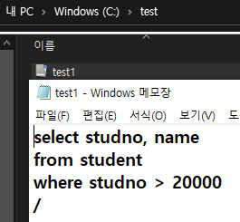
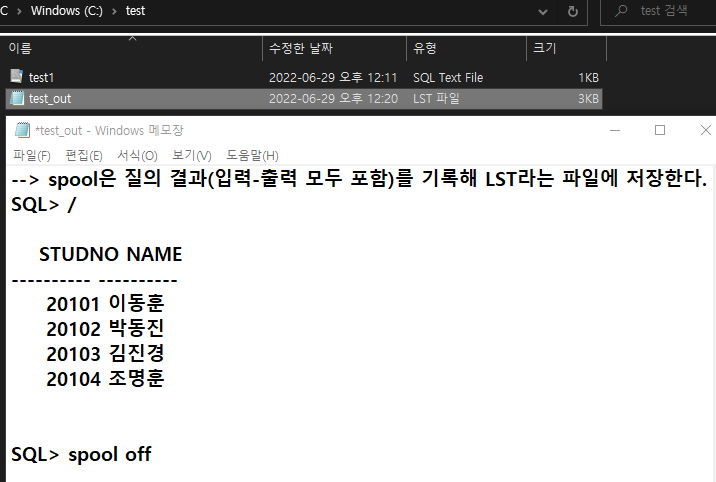

- 오늘 배운 SQL PLUS에 대한 내용을 정리하였다.

## SQL*PLUS

- sql*plus는 sql 명령문을 대화식으로 실행하기 위해 오라클 사에서 제공하는 소프트웨어 툴이다.
- cmd에서 `sqlplus "/as sysdba"` 을 입력하면 sys 유저로 접속할 수 있다.
- sqlplus는 칼럼이나 데이터의 출력형식을 지정하거나, SQL 명령문의 편집과 저장 기능을 제공한다.

___

## 1. SQL 명령어 비교

|SQL 명령문|SQP_PLUS 명령어|
|-----|-----|
|관계형 데이터베이스의 표준언어| SQL 명령문의 실행 환경을 제공하는 소프트웨어 툴|
|키워드 단축 불가(예: select, from, etc)| 키워드 단축 가능(예시: ST(ART), CONN(ECT) etc)|
테이블에 저장된 데이터 조작 가능| 데이터베이스 내의 데이터 조작 불가능|

___
## 2. SQL*PLUS

|유형|유형별 처리 기능과 SQP_PLUS 명령어 예시|
|-----|-----|
|환경|ECHO, FEED, LINE[SIZE], PAGE[SIZE]|
|형식|COLUMN, TPOSITION, SPOSITION, BREAK|
|파일조작|SAVE, GET, START(@), EDIT, SPOOL|
|실행|START(@),RUN,/|
|편집|A[PPEND], C[HANGE], DEL, I[NPUT], L[IST]|
|상호작용|&, &&, DEFINE, UNDEFINE, ACCEPT|
|기타|HOST, EXIT, CONNECT, !|

___
## 3. SQL_PLUS 사용 환경 명령어
- SQL 명령문의 실행 결과를 사용자가 효과적으로 확인할 수 있는 여러 가지 시스템 환경을 제어하기 위한 명령어다.

- 명령문의 기능 유지 기간
1. 세션이 종료되거나 환경 설정을 변경 혹은 삭제할 때까지 유지
2. 세션 사용자가 SQL_PLUS 툴로 로그인하여 로그아웃할 때까지 유지

### SET 명령어
- 현재 작업중인 세션의 환경을 제어하기 위한 시스템 변수를 설정한다.
> SET system_variable value
- system_variable : 시스템 변수
- value : 시스템 변수 값

### SHOW 명령어
- 시스템 변수의 현재 설정을 확인한다.
> SHOW ALL   
> SHOW system_variable
* ALL: 모든 시스템 변수 설정 값 확인
* system_variable : 특정한 시스템 변수의 설정 값을 확인

### 시스템 변수
- SQL 명령문의 실행 결과를 제어하기 위한 변수
> AUTOCOMMIT, FEEDBACK, HEADING, LINESIZE, PAGESIZE, PAUSE, TERMOUT, TIME, TIMING, UNDERLINE ...

#### AUTOCOMMIT 변수
- DML 명령문의 처리 결과를 디스크에 영구적으로 저장하기 위해서는 반드시 COMMIT 명령문을 실행해야 하는데, 이때 AUTOCOMMIT 변수가 on으로 설정되어있으면 자동적으로 COMMIT 명령문을 실행한다.


> AUTO[COMMIT] {off / on / imm[ediate] / n}                  
                        
- on(imm[ediate])은 DML 명령문 후 자동으로 COMMIT을 실행한다.
- off는 사용자가 직접 COMMIT을 실행해야 한다.
- n은 DML 명령문을 n번 성공적으로 수행했을 때 자동으로 COMMIT을 실행한다.


#### FEEDBACK 변수
- SELECT 명령문의 실행 결과를 표시하기 위해 출력 행의 수를 지정하는 변수로, "...개의 행이 선택되었습니다"라는 메시지의 출력 유무를 정의한다.
> FEED[BACK] {n / off / on}
- DEFAULT 값은 6으로, 6 이상의 행에 대해서만 FEEDBACK을 수행한다.


#### HEADING 변수
- SELECT 명령문의 실행 결과를 출력할 때, 칼럼 제목의 출력 여부를 제어한다.
> HEADING {off / on}
- off일 경우 칼럼 제목을 출력하지 않는다.

#### LINESIZE 변수
- 한 화면에서 표시되는 SQL 명령문의 출력 결과에 대한 행의 크기를 설정한다.
> LIN[ESIZE] {n}
- DEFAULT : 80
- LINESIZE가 행이 표현하는 길이보다 작으면 하나의 ROW가 여러 줄로 나타난다.

#### PAGESIZE 변수
- 한 화면에서 표시되는 SQL 명령문의 실행 결과에 대한 페이지의 크기를 설정하는 변수
> PAGES[IZE] {n}
- DEFAULT : 14
- 컬럼 제목을 포함하여 출력행이 PAGESIZE보다 많다면, 칼럼 제목이 재출력된다.

#### PAUSE 변수
- SQL 명령문의 실행 결과를 한 화면에서 보기 힘든 경우, 한 페이지씩 나누어 출력하기 위한 변수이다.
> PAUSE {on / off}
- PAUSE on의 경우, 사용자가 엔터키를 입력할 때까지 대기한다.

#### TERMOUT 변수
- SQL 명령문 실행 결과를 화면에 출력할 지 여부를 지정하기 위한 변수이다.
> TERM[OUT] {off / on}

예시:
```
SQL> set termout off
SQL> @sqlFile
SQL> set termout on
SQL> @sqlFile

NAME    TABTYPE
---------------
KIM     TABLE

```
- 위처럼 termout off일때는 SQL 파일 실행 결과가 화면에 출력되지 않는다.

#### TIME 변수
- SQL 프롬프트 앞에 시스템의 현재 시간을 함께 표시하도록 설정한다.
> TI[ME] {off | on}                      

```
SQL> set time on
15:21:30 SQL>
15:21:42 SQL>set time off
SQL>
```   

#### TIMING 변수
- SQL 명령문을 실행하는 데 걸린 시간을 출력하기 위한 변수로, '시:분:초.밀리초' 형식으로 표현한다.
> TIMING {off | on}                      

```
SQL> set TIMING on
SQL> SELECT * FROM department;
.
.
.
경 과: 00:00:00:00
```

#### UNDERLINE 변수
- 칼럼 제목과 데이터간의 구분 기호를 설정하기 위한 변수이다.
> UND[ERLINE] {- | c | off | on}
- c : 모든 문자
- on : 구분기호 사용
- off : 구분기호 미사용   

예시:
```
SQL> set und "+"
SQL> select * from department;

DEPTNO     DNAME
++++++++++++++++++++++
   101     컴퓨터공학과
   102     멀티미디어학과
```


___
## 4. SQL_PLUS 형식 명령어
- SQL 명령문의 실행 결과에 대한 칼럼 제목이나 데이터 출력 형식을 변경하기 위한 명령어이다.

### COLUMN 명령어
- SQL 명령문의 실행 결과로 출력되는 칼럼 제목이나 칼럼 데이터에 대한 출력 형식을 다양하게 지정하기 위한 명령어이다.
> COLUMN {column / alias} [option] [format]

#### option

|종류|의미|
|-----|-----|
|CLE[AR]|칼럼에 지정된 형식 해제|
|FOR[MAT] format| 칼럼 데이터의 출력 형식을 지정한다. 뒤에 [format]이 추가로 붙는다.|
|HEA[DING] text| 칼럼의 제목을 설정한다. 뒤에 [text]가 추가로 붙는데, text내의 수직(shitf + '\')바는 칼럼 제목을 여러 줄로 출력할 때 쓰인다|
|JUS[TIFY] align|칼럼 제목을 왼쪽, 가운데, 오른쪽 정렬할 때 쓰인다. 뒤에 'LEFT, RIGHT, CENTER'가 붙는다|
|NOPRI[NT]|칼럼 숨기기|
|PRI[NT]|칼럼 출력하기|
|NUL[L] text| NULL값을 뒤에 붙는 [text]로 대체하여 출력한다.|               

#### format

|종류|의미|사용예시|
|-----|-----|-----|
|An|문자형식 칼럼의 출력 크기를 n폭으로 설정|'column dname format a20'|
|9|단일 숫자(단, 쓸모없는 0을 억제)|999999->1234|
|0|단일 숫자(쓸모없는 0 보존)|000000->001234|
|$|숫자 앞에 달러 기호 삽입|$9999->$1234|
|L|숫자 앞에 지역 화폐 기호 삽입|L9999->W1234|
|.|소수점 위치 지정|99.99->1234.00|
|,|1000자리마다 ',' 구분자 삽입|9,999->1,234|               

- 위에서 An(예시: col name format a20;)은 출력할 때 자주 사용하므로 기억해두자.
- 주의할 점: 숫자 데이터의 출력 형식을 문자 형식으로 설정하거나, 출력 데이터의 길이가 숫자 형식의 자리 수를 초과하게 되면 전체가 '#' 기호로 출력된다   
예시:
```
column height format 99
# 입력값이 100 이상이면 전체가 '#' 기호로 출력됨
```

#### 칼럼에 대한 설정 내용 확인 및 해제하기 위한 옵션: CLE[ER]   

|종류|의미|
|-----|-----|
|COL[UMN] col|특정 칼럼에 대한 현재 설정 값 출력|
|COL[UMN]|모든 칼럼에 대한 현재 설정 값 출력|
|COL[UMN] col CLE[AR]|특정 칼럼에 대한 현재 설정 값 해제|
|CLE[AR] COL[UMN]|모든 칼럼에 대한 현재 설정 값 해제|                 

___
## 5. SQL_PLUS 편집 명령어
- SQL_PLUS에서 최근에 실행된 SQL 명령문은 임시 기억공간인 SQL BUFFER에 저장되는데, 이 저장된 명령문을 SQL_PLUS 편집 명령으로 편집할 수 있다.

### SQL_PLUS 편집 명령어

|명령어|축약어|기능|
|-----|-----|-----|
|APPEND text|A text|SQL 버퍼의 현재 라인 끝에 text 추가|
|CHANGE /old/new|C /old/new|현재 라인의 old text를 new text로 변경한다. 이때, '/NEW'가 존재하지 않으면 old text를 지우는 역할을 수행한다.(띄어쓰기에 유의할 것)|
|CLEAR BUFFER|CL BUFF|모든 라인 삭제|
|DEL|DEL|현재 라인 삭제|
|DEL n|DEL n|n 번째 라인 삭제|
|DEL m n|DEL m n|m ~ n 라인 삭제|
|INPUT|I|현재 라인 다음에 추가|
|INPUT text|I text|현재 라인 다음에 TEXT 추가|
|LIST|L|모든 라인 출력|
|LIST n|L n|n번째 라인의 text 출력|
|LIST m n|L m n|m ~ n 라인의 text 출력|
|n|n|n번째 라인으로 이동|
|n text|n text|n번째 라인 내용을 text로 변경|
|0 text|0 text|가장 윗 라인 앞에 text 추가|               


## SQL_PLUS 실행명령
- R[UN] : 버퍼의 현재 SQL문을 표시하고 실행]
- / : 버퍼의 현재 SQL문을 표시하지 않고 실행

예시:
```
SQL> R
1 SELECT NAME
2*FROM GROUP_A

NAME
------
 KIM
~~~~~~~~~~~~~~~~~~~~~~~~~~~~~~~~~

SQL> /

NAME
------
 KIM

```

___
## 6. SQL_PLUS 파일조작 명령어
- SQL 버퍼에 저장된 SQL 명령문을 파일에 저장하거나 파일에 저장된 명령문을 읽어올 수 있도록 하는 명령어다.

|명령어|의미|
|-----|-----|
|SAV[E] filename|현재 SQL 버퍼의 내용을 파일에 저장한다|
|GET filename|SAVE 명령어로 저장한 파일을 SQL 버퍼에 읽어온다|
|STA[RT] filename, @filename|파일을 읽고 즉시 실행|
|ED[IT] filename|저장된 파일 내용을 편집한다. 현재 SQL 버퍼의 내용을 편집할 수도 있다.|
|SPO[OL] [filename / OFF / OUT]|파일에 출력 결과를 저장한다.|


#### SAVE 명령어   
> SAV[E] filename [REP[LACE] / APP[END]]        
         
- REPLACE : 기존 파일에 겹쳐 쓴다
- APPEND : 기존 파일에 내용을 추가한다
- 저장되는 파일의 기본 확장자는 .sql이다.

예시:
```
SQL> sav c:\test\test1
```


#### GET 명령어
예시:
```
SQL> cl buff
버퍼가 소거되었습니다.

SQL> L
SP2-0223: SQL버퍼에 줄이 없습니다.

SQL>GET c:\test\test1
1   select studno, name
2   from student
3   where studno > 20000
```

#### SPOOL 명령어   
> SPO[OL] [filename | off | out]                  

- 질의 결과를 파일에 저장한다.
- off : spool file을 닫음
- out : spool file을 닫은 후 파일 결과를 시스템 프린터로 전송한다
- 저장되는 파일의 확장명은 .LST이다.

예시:
```
SQL> spool c:\test\test_out
SQL> /

  STUDNO NAME
------ -----
 20101 이동훈
 20102 박동진
 20103 김진경
 20104 조명훈

SQL>spool off
```


#### 실행 명령어
> STA[RT] filename, @filename            

- 이전에 저장한 명령 파일을 실행한다.

#### 기타 명령어
- HOST: Windows 운영체제(를 사용한다면)로 전환할 수 있다.
- EXIT : 종료한다.
