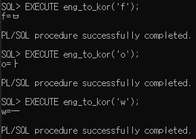

<br><br>
PL/SQL은 데이터 베이스 관리 영역에서 매우 중요하나, SQL 입문자에게 '통곡의 벽'으로 불릴 만큼 어려운 난이도를 가진다. (그래서 이 영역을 주로 다루는 '데이터 분석가'같은 경우는 대학원 석박사 과정을 마친 사람만 채용하기도 한다.)

물론 우리는 (석박사만 뽑는) 데이터 분석가가 되려는건 아니니까... PL/SQL을 마스터 할 필요는 없고, 이게 어떤 방식으로 돌아가는지, 왜 'PL/SQL'이 중요시 되는지만 이해하면 된다.

___

<br><br>
우선, 실습을 위해 다음 명령어로 'korean' 테이블을 생성해보자.

```
CREATE TABLE korean(kor CHAR(3), k_num NUMBER);

DESC korean;
```
<br><br>
우리는 이 테이블을 '한글과 대응하는 숫자'를 기록하기 위해 사용할 것이다.

ㄱ = 1, ㄴ = 2 .... ㅁ = 5 ...이렇게 말이다.

이제 테이블에 값을 기록해야 하는데... 이건 다음 식을 복사해서 넣어보자.
```
INSERT ALL 
    INTO korean VALUES ('ㄱ', 1)
    INTO korean VALUES ('ㄴ', 2)
    INTO korean VALUES ('ㄷ', 3)
    INTO korean VALUES ('ㄹ', 4)
    INTO korean VALUES ('ㅁ', 5)
    INTO korean VALUES ('ㅂ', 6)
    INTO korean VALUES ('ㅅ', 7)
    INTO korean VALUES ('ㅇ', 8)
    INTO korean VALUES ('ㅈ', 9)
    INTO korean VALUES ('ㅊ', 10)
    INTO korean VALUES ('ㅋ', 11)
    INTO korean VALUES ('ㅌ', 12)
    INTO korean VALUES ('ㅍ', 13)
    INTO korean VALUES ('ㅎ', 14)
    INTO korean VALUES ('ㅏ', 15)
    INTO korean VALUES ('ㅑ', 16)
    INTO korean VALUES ('ㅓ', 17)
    INTO korean VALUES ('ㅕ', 18)
    INTO korean VALUES ('ㅗ', 19)
    INTO korean VALUES ('ㅛ', 20)
    INTO korean VALUES ('ㅜ', 21)
    INTO korean VALUES ('ㅠ', 22)
    INTO korean VALUES ('ㅡ', 23)
    INTO korean VALUES ('ㅣ', 24)
SELECT * FROM DUAL;
```
<br><br>
___


- 알파벳(a,b,c)을 입력하면 한글(ㄱ,ㄴ,ㄷ)을 출력하는 프로시저를 만들어보자.


일단, 다음을 입력해보자
```
SQL> select ascii('A') from dual;

ASCII('A')
----------
        65
```
갑자기 이것을 왜 입력했는가? 바로 아스키코드를 이용할 예정이기 때문이다.


___
<br><br>


대문자 'A'가 65라는 점을 이용하자.
```
CREATE OR REPLACE PROCEDURE eng_to_kor(p_al  IN  char(3))
IS
    k_row   korean%ROWTYPE;
BEGIN
    SELECT *
    INTO k_row
    FROM korean
    WHERE k_num = ASCII(upper(p_al)) - 64;
    DBMS_OUTPUT.PUT_LINE(p_al || '=' || k_row.kor);
END;
/
```
upper로 대소문자를 모두 대문자로 통일시킨 뒤, ASCII 코드로 변환해 64를 빼면 된다.

___

이제, 해당 프로시저로 우리는 f, o, w이 어느 한글 자음과 비교되는 지 알 수 있다.
- set serveroutput on 필수! (기본 설정이 off이다)   




___

이제 우리는 마음껏 알파벳을 한글 자모음으로 변환할 수 있다.
하지만, 해당 프로시저는 치명적인 단점이 있다.


한글 자모음 합친것이 알파벳보다 양이 적기 때문에, 'z'를 입력하면 에러 메시지가 뜬다.


___


## 에러처리

```
CREATE OR REPLACE PROCEDURE eng_to_kor(p_al  IN  char(3))
IS
    k_row   korean%ROWTYPE;
BEGIN
    SELECT *
    INTO k_row
    FROM korean
    WHERE k_num = ASCII(upper(p_al)) - 64;
    DBMS_OUTPUT.PUT_LINE(p_al || '=' || k_row.kor);
EXCEPTION
WHEN NO_DATA_FOUND THEN
    DBMS_OUTPUT.PUT_LINE('해당 알파벳과 대응되는 한글은 없습니다.');
END;
/
```
- 위와 같이 EXCEPTION WHEN ~ 절을 이용해서, 해당 에러를 처리하는 루틴을 만들었다.


___

### 추신

(1) 프로시저나 함수는 sqldeveloper에서 자유롭게 수정이 가능하다.


(2) DBMS_OUTPUT.PUT_LINE("문자열")은 "문자열"을 화면에 출력하기 위한 함수이다. 이를 사용하기 위해서는 serveroutput이라는 시스템 변수를 on으로 설정해야 한다. (sqldeveloper에서도 마찬가지)

___

## 정리

- 만약 PL/SQL 없이 해당 기능을 수행하려면, 알파벳 하나 하나의 결과를 얻기 번거로웠을 것이다.
- PL/SQL 덕분에 짧은 입력으로 복잡한 업무를 수행할 수 있었다.
 

이것으로 프로시저 실습을 마친다.

또한, 위 내용을 기반으로 '한글 자모음'을 입력해서 '알파벳(대문자)'를 출력하는 프로시저 kor_to_eng를 생성할 수도 있다.