## HTTP 통신 방식
- 하이퍼텍스트 문서를 교환하기 위해 만들어진 통신 규약
- TCP / IP 프로토콜 기반
- 요청(Request) 및 응답(Response) 구조
- HTTP는 어떠한 상태(Statement)를 저장하지 않는다.

## HTTP 구조

1. 요청시

    |구조|내용|
    |--|--|
    |Start Line|Request URL(요청 URL)<br>Request Method(Post, Get, Put, Delete)|
    |Header|accept(application/json)<br>user-agent(Mozilla/5.0)<br>content-type(application/x-www-form-urlencoded; charset=UTF-8)|
    |Body|<br><br><br>전송하고 싶은 데이터<br><br><br><br>|
    |||


    - 헤더에서 각각의 특성에 대해서 (Key / Value) 형태로 선언하였다.

<br>

2. 응답시
  
    |구조|내용|
    |--|--|
    |Status Line|Status Code<br>200 - 오류없이 성공<br>301 - URL이 중간에 다른 주소로 변경됨<br>400 - 요청 자체가 잘못됨<br>401 or 403 - 권한 없음<br>404 - 페이지가 존재하지 않음<br>500 - 서버 오류|
    |Header|accept(application/json)<br>user-agent(Mozilla/5.0)<br>content-type(application/x-www-form-urlencoded; charset=UTF-8)|
    |Body|<br><br><br>전송하고 싶은 데이터<br><br><br><br>|
    |||

### GET 구조
- 요청 시 Body가 없음
- 데이터 전달 시 파라미터(Parameters) 사용
- URL(일반적인 주소)?key=value&key=value(키와 값이 기록됨, 물음표 뒤에는 Query String Parameters라고 함)

예시: "https://search.naver.com/search.naver?where=nexearch&sm=top_hty&fbm=1&ie=utf8&query=%ED%8C%8C%EB%9D%BC%EB%AF%B8%ED%84%B0"

- 위에서, ~naver 오른쪽에 '?'표시가 있는 걸 알 수 있다. '%ED%8C%8C%EB%9D%BC%EB%AF%B8%ED%84%B0'는 한국어가 변형된 값. 여기에 다른 한국어 입력하면, 해당 내용의 검색 결과가 나타남

### POST, PUT, DELETE 방식
- body에 json 형태의 파일을 삽입하여 내용을 전송한다.

- json은 {key : value} 형식으로 되어있는 텍스트로 되어있다. (파이썬의 dictionary와 유사)


___

## HTML

예시)

```HTML
<!DOCTYPE html> -- html의 버전
<html> -- html의 시작
<head> -- 헤더의 시작
    <title>타이틀</title> -- '타이틀'이라는 title 생성
</head> -- 헤더 닫기
<body> -- 바디 열기
    <h1>저의 첫 웹사이트에 오신걸 *환영합니다*.</h1> -- 
</body> -- 바디 닫기
</html> -- html 닫기
```
위 html을 실행한 결과는 아래와 같다.

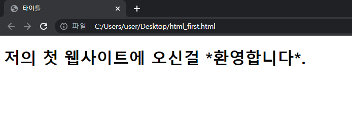

<br><br>

이때, '< >'안에 들어간 키워드를 '태그'라고 하며, 모든 태그는 아래와 같은 구조를 가진다.

> <태그>내용</태그>

혹은

> <태그 태그옵션="옵션값">내용</태그>

___

### 하이퍼텍스트('a' tag)

사용 방법은 아래와 같다.

> <a. href="documentary.html">다음페이지<\/a>   

href에 이동할 페이지를 입력하거나, 또는
> <a. href="http://url.com" target="_blank">다음페이지<\/a>   

이동할 url(주소)를 입력하면 된다.

|target|페이지를 어떻게 열 것인가|
|--|--|
|_blank|새창으로|
|_self|현재 페이지|
|_parent|부모 프레임|
|_top|가장 상위 프레임|

- _parent, _top은 잘 쓰지 않는다.
```HTML
<a href="https://naver.com" target="_blank">네이버로 출발</a>
```
위를 실행한 결과는 아래와 같다.

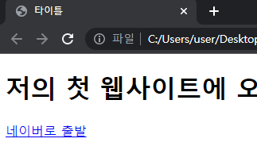 
<br>
<br>

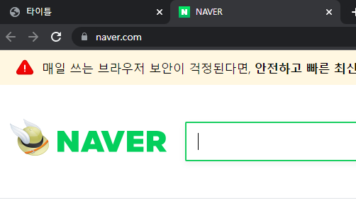

<br>
___

### 목록 태그

```HTML
<ul>
    <li>1번째</li>
    <li>2번째</li>
    <li>3번째</li>
    <li>4번째</li>
</ul>
-----------------------
<ol>
    <li>1번째</li>
    <li>2번째</li>
    <li>3번째</li>
    <li>4번째</li>
</ol>
```
위를 실행한 결과는 아래와 같다.

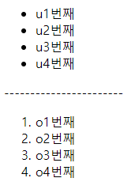

___

### 제목 태그

```HTML
<h1>제목1</h1>
<h2>제목2</h2>
<h3>제목3</h3>
<h4>제목4</h4>
<h5>제목5</h5>
<h6>제목6</h6>
```
위를 실행한 결과는 아래와 같다.

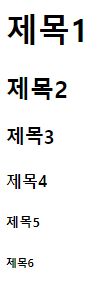

___

### 이미지 태그

```HTML


<a href="https://naver.com"></a>
```
- 위처럼 이미지만 올릴 수도 있고, 이미지에 하이퍼링크를 설정해 줄수도 있다.
- 중요한건, img의 경로를 정확히 파악해야 한다.

```HTML


<a href="https://naver.com">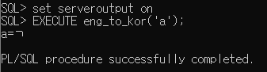</a>
```
- 위를 실행한 결과는 아래와 같다.

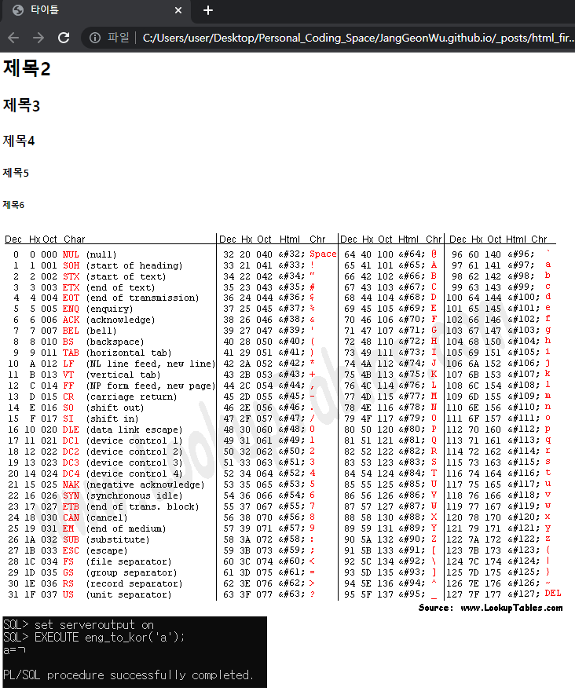

___

### 단락태그

```HTML
<p>
    내용이 많이 들어있는 경우에 사용된다.
    여러줄로 표시되는 것을
    하나의 단락으로 묶어 다루는 데 쓰인다.
</p>
<p>
    여러개의 p
    그러니까 단락이 여러개일 때
    웹 페이지에서 어떻게 출력되는지 확인해보자.
</p>

```
- 위를 실행한 결과는 아래와 같다.

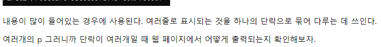


___

### 인라인 태그들

- 텍스트를 꾸미는 역할을 수행한다.

```HTML
<p>
    ahgouipwrhoasjg<span> hnrkgahfeuioghgl </span>eofgjkalfgahsfgjfahgklhgkoa
    ㅁㄴ햐ㅣ겨ㅑ모이<b>룸ㄴㅇ리;</b>훔ㄷ랴ㅗㄷ갷갸봥즈람늎먀ㅐㄹ류ㅜㅁ노휴
    247854897489154654636248164818<em>4547848</em>9467854
</p>
```
위를 실행한 결과는 아래와 같다.


- span은 개별적인 구역을(css style 태그로 꾸밀 수 있음, 개발자 모드로 보면 따로 구역이 정해진 걸 볼 수 있음), b는 bold체를, em은 italic체를 표현한다.

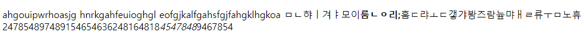

___

### DIV 태그


- 여러가지 태그나 영역을 묶어 사이트의 구조를 잡을 때 사용한다.


```HTML
<div>
    <a href="https://naver.com"></a>
    <p>
        ahgouipwrhoasjg<span> hnrkgahfeuioghgl </span>eofgjkalfgahsfgjfahgklhgkoa   
        ㅁㄴ햐ㅣ겨ㅑ모이<b>룸ㄴㅇ리;</b>훔ㄷ랴ㅗㄷ갷갸봥즈람늎먀ㅐㄹ류ㅜㅁ노휴   
        247854897489154654636248164818<em>4547848</em>9467854
    </p>
</div>
```

- 화면 상에 보이지는 않지만, 개발자모드로 확인이 가능하다.
- div 단위로 css style 적용이 가능하다.

___

### 테이블 태그

- 테이블 태그는 다음과 같이 2개의 종류로 나뉜다.

```HTML
<table>
    <tr>
        <td>표1</td>
        <td>표2</td>
    </tr>
    <tr>
        <td>표3</td>
        <td>표4</td>
    </tr>
</table>    
------------------------------
<table>
    <thead>
    <tr>
        <th>표5</th>
        <th>표6</th>
    </tr>
    </thead>
    <tbody>
    <tr>
        <td>표7</td>
        <td>표8</td>
    </tr>
    <tr>
        <td>표9</td>
        <td>표10</td>
    </tr>
    </tbody>
</table> 
```

- 위를 실행한 결과는 아래와 같다.

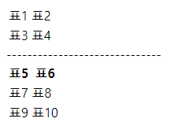

- 첫번째 테이블은 '속성'을 표시하는 구간이 없고, 두번째 테이블은 **굵게** 존재한다.
- 아무런 설정도 안하면 위처럼 구간을 나누는 선이 없이 생성된다.

___

### 폼 태그

- 사용자의 입력을 받거나 다룰 때 사용한다.

```HTML
<input type="text" value="값을 입력해주세요"/><br>
<textarea cols="50" rows="5">값을 입력해주세요</textarea>
<select>
    <option value="1">first</option>
    <option value="2">second</option>
    <option value="3">third</option>
</select><br>
<input type = "submit" value = "전송"><br>
<input type = "button" value = "버튼">    
```

- 위를 실행한 결과는 아래와 같다.

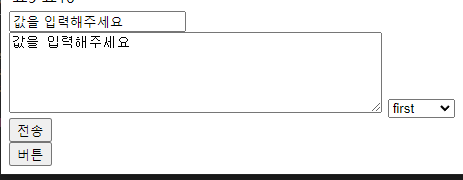

___

### 태그에 이름 붙이기

1. ID(#)
    - 태그에 고유한 이름 부여, 해당 이름은 한번만 사용해야 함, CSS에서 검색 시 #를 사용

2. CLASS(.)
    - 태그에 이름을 붙임, 여러번 중복해서 사용 가능, CSS에서 검색 시 .를 사용

예시:
```HTML
<div id="menu">
    <div class="s_menu">메뉴1</div>
    <div class="s_menu">메뉴2</div>
    <div class="s_menu">메뉴3</div>
</div>    
...........
<style>
#menu{ ~~~~ }
.s_menu{ ~~~~ }
</style>
```    

- 이런 식으로 사용이 가능하다.


_____

- 지금까지 HTTP와 HTML을 매우 간략하게 정리하였다.

<a href="./html_first.html">다음페이지</a>