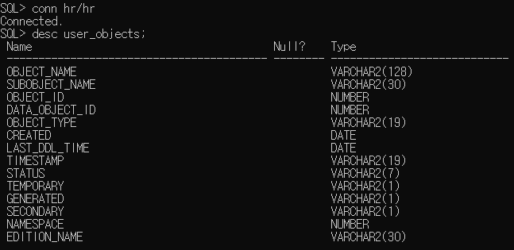

<br><br>
트리거와 PL/SQL 관리에 대한 개요를 정리하고자 한다.

___


# 트리거
- 어떤 사건이 발생했을 때, 내부적으로 실행되도록 데이터베이스에 저장된 프로시저를 의미한다.
- 즉, 트리거가 실행되어야 할 이벤트(Triggering Event)가 발생될 시 자동으로 실행되는 프로시저와 같다.

- 선언절, 실행절, 예외절을 가지는 PL/SQL 블록 구조를 가지고 데이터베이스에 저장되어야 한다.
- 트리거링 사건, 오라클 DML 문인 INSERT/DELETE/UPDATE가 실행되면 자동으로 실행된다.


## 트리거의 구성 요소

|구성 요소|가능한 값|설명|
|--:|:--:|:--|
|유형|Statement Level, Row Level|트리거 몸체의 내용이 몇 번이나 실행되는가?|
|타이밍|BEFORE / AFTER|사용자가 트리거 이벤트를 유발시킬 때 데이터베이스 트리거를 언제 실행하는가?|
|이벤트|INSERT/UPDATE/DELETE|테이블 상에 어떤 데이터 조작연산이 트리거를 발생시키는가?|
|몸체|PL/SQL BLOCK|어떤 이벤트가 발생하면 어떤 작업이 수행되는가?|
|조건|WHEN [condition]|사용자의 트리거 이벤트 중에 조건을 만족하는 데이터만 트리거를 수행한다.|

## 트리거의 사용 범위
1. 데이터베이스 테이블을 생성하는 과정에서 참조 무결성과 데이터 무결성 등의 복잡한 제약 조건을 생성하는 경우.
2. 데이터베이스 테이블의 데이터에 생기는 작업의 감시, 보완
3. 데이터베이스 테이블에 생기는 변화에 따라 필요한 다른 프로그램을 실행하는 경우
4. 불필요한 트랜잭션을 금지하기 위해서
5. 컬럼의 값을 자동으로 생성되도록 하는 경우에
6. 복잡한 뷰를 생성하는 경우에

## 트리거 생성하기
 - CREATE TRIGGER 문을 사용하여 생성한다. 이때, 'CREATE TRIGGER' 권한이 있어야만 한다.

 ```
 CREATE TRIGGER trigger_name IS
 [타이밍] [이벤트 - 1] [OR 이벤트 -2 OR .....]
 ON table_name
 BEGIN
    .....
 END;
 ```
 
 위의 문법을 알아보기 쉽게 예시를 들어보자면,
 ```
 CREATE TRIGGER check_emp IS
 BEFORE INSERT or UPDATE or DELETE
 ON emp (FOR EACH ROW)
 BEGIN
    (수행할 것)
 END;
 ```

 - 위의 FOR EACH ROW 옵션절은 '행 레벨 트리거'를 의미한다.


## 문장 레벨 트리거 VS 행 레벨 트리거

1. 문장 레벨 트리거
    - 트리거링 사건에 대하여 '딱 한번만' 실행한다.
    - 컬럼의 각 데이터 행을 제어할 수 없다.
    - 칼럼의 데이터 값에 관계 없이 컬럼에 변화가 일어남을 감지해 실행되는 트리거이다.

2. 행 레벨 트리거    
    - 컬럼의 각 데이터 행이 변경될 때마다 실행된다.
    - 실제 그 데이터 행의 값을 제어할 수 있는 트리거이다.
    - 실제 값을 수정, 변경 및 저장하기 위해서 사용된다.
    - 행 트리거에서 실제 데이터를 제어하기 위해서 사용하는 인자는 ':old'와 ':new'가 있다.
    - insert문의 경우, 입력할 데이터의 값을 ':new.컬럼이름'에 저장한다.
    - update문의 경우, 변경 전의 데이터는 ':old.컬럼이름'에 대응되고 변경 후의 데이터는 ':.new.컬럼이름'에 대응된다.
    - delete문의 경우, 삭제할 컬럼 값을 ':old.컬럼이름'에 대응시킨다.

    - 행 레벨 트리거의 예시를 들어보자.

    ```
    CREATE TRIGGER backup_emp
    BEFORE INSERT OR DELETE OR UPDATE on emp
    BEGIN
        IF INSERTING THEN -- INSERT가 이루어질때
            INSERT INTO back_emp(deptno, dname, sal, gu)
            VALUES(:new.deptno, :new.name, :new.sal, '입력');
        ELSIF UPDATING THEN -- UPDATE가 이루어질때
            INSERT INTO back_emp
            VALUES(:new.deptno, :new.name, :new.sal, :old.deptno, :old.name, :old.sal, '수정');
        ELSIF DELETING THEN -- DELETE가 이루어질때
            INSERT INTO back_emp(deptno, dname, sal, gu)
            VALUES(:old.deptno, :old.name, :old.sal, '삭제');
        END IF;
    END;
    ```
    - emp라는 테이블에 트리거 이벤트가 발생하면, 삽입/수정/삭제된 row에 대한 내용을 back_emp라는 테이블에 INSERT하는 트리거이다.
    - 행 레벨 트리거이기 때문에, :old와 :new가 쓰인 것을 볼 수 있다.


## 트리거, Cascade
- 한 트리거가 다른 트리거를 실행시키는 것이다.
- 트리거가 '프로시저'나 '함수'를 사용하는 것은 쉬우나, '다른 트리거'를 사용할 때는 '모든 제약조건'을 파악해야 한다.    

~~(물론 프로시저나 함수 사용할 때도 제약조건 파악은 필요하긴 하다.)~~


## 트리거 삭제, 활성화-비활성화, 재 컴파일

1. 트리거 삭제
> DROP TRIGGER trigger_name;

2. 트리거 활성화 및 비활성화
> ALTER TRIGGER trigger_name DISABLE | ENABLE | DISABLE ALL TRIGGER | ENABLE ALL TRIGGER;

3. 트리거 재 컴파일
> ALTER TRIGGER trigger_name COMFILE;

## 프로시저, 트리거의 차이점

|프로시저|트리거|
|--|--|
|CREATE PROCEDURE|CREATE TRIGGER|
|EXECUTE 명령어로 실행|EVENT에 의해 자동실행|
|COMMIT, ROLLBACK 실행 가능|COMMIT, ROLLBACK 실행 불가능|

## 트리거의 역할

|범위|설명|
|--|--|
|보안|데이터베이스 내 테이블에 대한 변경을 제한할 수 있다.|
|감사|사용자들의 데이터베이스 사용에 대한 모든 내용을 감시할 수 있다.|
|데이터 무결성|테이블에 원하지 않는 데이터가 저장되는 것을 방지할 수 있다.|
|테이블 복제|기본 테이블에 대한 똑같은 복사 테이블을 온라인으로 생성 및 관리할 수 있다.|
|연속적인 작업 수행|기본 테이블에 데이터가 입력되면 또 다른 테이블에 데이터를 조작하는 연속적인 작업을 수행할 수 있다.|

다음은 트리거로 테이블을 관리하는 예시이다.
```
CREATE OR REPLACE TRIGGER cascade_updates
AFTER UPDATE on DEPT -- dept 테이블에서 update가 발생할 때
FOR EACH ROW
BEGIN
    UPDATE emp SET emp.deptno = :new.deptno -- deptno를 DEPT update 후 값으로 update
    WHERE emp.deptno = :old.deptno; -- deptno가 DEPT update 전 값일 때
END;
```
위의 트리거가 있고, 아래의 update문을 실행한다고 가정하여보자.

```
UPDATE DEPT SET deptno = 30
WHERE deptno = 10;
```
DEPT 테이블의 deptno = 10인 모든 행에 대하여 deptno = 30으로 수정한다는 의미이다.
위 상황에서, :new.deptno 는 30, :old.deptno 는 10이다.

따라서, 트리거에 의하여 deptno가 10인 emp 테이블의 deptno가 30으로 수정되게 된다.

___

# PL/SQL 관리

- 오라클 데이터베이스에는, 유저의 객체-트리거-Source를 정리한 테이블이 존재한다.



위의 그림처럼, 메타 데이터가 존재한다.
다음은 이러한 테이블들을 정리한 표이다.

1. USER_OBJECTS
    - 데이터베이스 내의 모든 객체를 참조할 수 있다.

    |컬럼|설명|
    |--|--|
    |OBJECT_NAME|객체의 이름|
    |OBJECT_ID|데이터베이스가 객체를 관리하는 번호|
    |OBJECT_TYPE|객체의 유형으로<BR>TABLE-PROCEDURE-FUNCTION-PACKAGE가 있다.|
    |CREATED|객체를 마지막으로 수정한 날짜|
    |TIMESTAMP|객체가 마지막으로 컴파일된 날짜와 시간|
    |STATUS|객체의 사용가능 여부<BR>VALID, INVALID|

2. USER_SOURCE    
    - PL/SQL 블록의 SOURCE 내용을 참조할 수 있다.

    |컬럼|설명|
    |--|--|
    |NAME|객체의 이름|
    |TYPE|객체의 유형으로<BR>TABLE-PROCEDURE-FUNCTION-PACKAGE가 있다.|
    |LINE|PL/SQL 블록의 소스 코드의 행 번호|
    |TEXT|PL/SQL 블록의 소스 코드|

3. USER_ERRORS
    - PL/SQL 블록 생성 시 발생한 에러를 참조할 수 있다.

    |컬럼|설명|
    |--|--|
    |NAME|객체의 이름|
    |TYPE|객체의 유형<BR>TABLE-PROCEDURE-FUNCTION-PACKAGE|
    |SEQUENCE|에러를 표시하기 위한 일련번호|
    |LINE|에러가 발생한 소스코드의 행 번호|
    |POSITION|에러가 발생한 행의 위치|
    |TEXT|에러 내용|

4. USER_TRIGGER
    - 트리거의 종류와 상태정보를 참조할 수 있다.

    |컬럼|설명|
    |--|--|
    |TRIGGER_NAME|트리거의 이름|
    |TRIGGER_TYPE|트리거의 유형<BR>BEFORE, AFTER, INSTEAD OF|
    |TRIGGER_EVENT|트리거 이벤트<BR>UPDATE, INSERT, DELETE|
    |TRIGGER_LINE|트리거 이벤트가 되는 테이블|
    |REFERENCING_NAMES|:OLD, :NEW에 대해 사용된 이름|
    |WHEN_CLAUSE|행 레벨 트리거에 사용된 WHEN절의 내용|
    |STATUS|트리거의 사용 가능 여부|

5. DESCRIBE 명령어
    > DESC object_name

    - 트리거에 사용된 IN-OUT 매개변수의 상태를 참조할 수 있다.

    
    ```
    SQL > DESCRIBE CHK_SAL

    FUNCTION CHK_SAL RETURN NUMBER -- RETURN되는 값의 타입을 알 수 있다.

    ARGUMENT    NAME_TYPE   IN/OUT  DEFAULT
    ---------------------------------------
    V_NO        NUMBER      IN      

    ```

    |컬럼|설명|
    |--|--|
    |ARGUMENT|매개변수의 이름|
    |NAME_TYPE|매개변수의 유형|
    |IN/OUT|매개변수의 IN-OUT 여부|
    |DEFAULT|매개변수의 DEFAULT 값|

6. USER_DEPENDENCIES
    - 상호간에 참조하는 PL/SQL 블록의 의존관계를 참조할 수 있다.

    ```
    SQL > SELECT * FROM USER_DEPENCIES
          WHERE referenced_name IN ('EMP');

    

    NAME    TYPE        REFERENCED_NAME  REFERENCED_TYPE
    ----------------------------------------------------
    A       PROCEDURE   B                PROCEDURE
    B       PROCEDURE   EMP              TABLE      
    ```

    |컬럼|설명|
    |--|--|
    |NAME|참조를 한 객체의 이름|
    |TYPE|참조를 한 객체의 타입|
    |REFERENCED_NAME|참조된 객체의 이름|
    |REFERENCED_TYPE|참조된 객체의 타입|

    - 위의 표를 통해, 프로시저 a는 프로시저 b를 참조하고, 프로시저 b는 테이블 emp를 참조하는 것을 알 수 있다.

7. DEPTREE와 IDEPTREE VIEW
    - 상호간에 참조하는 PL/SQL 블록의 의존관계를 TREE 형태로 참조할 수 있다.

    ```
    SQL > @$HOME/rdbms/admin/utldtree.sql
    SQL > EXECUTE deptree_fill('TABLE', 'SCOTT', 'EMP');

    SQL > SELECT nested_level, type, name FROM deptree
          ORDER BY seq#;

    

    NESTED_LEVEL    TYPE        NAME
    ------------------------------------
    0               PROCEDURE   A               
    1               PROCEDURE   B                 
    ```

___

- 여기까지 트리거와, 데이터베이스 관리에 쓰이는 메타 데이터 테이블들을 정리하였다.


