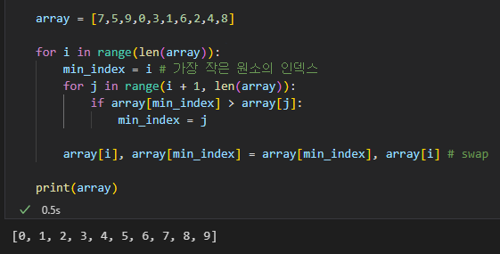
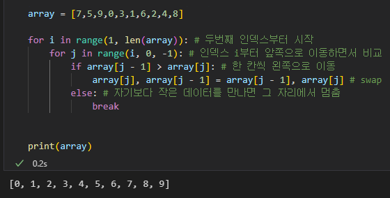
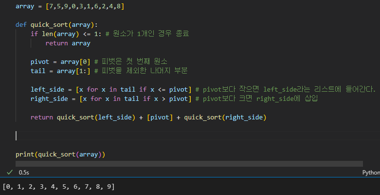
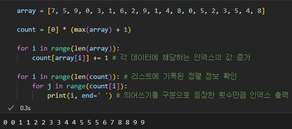
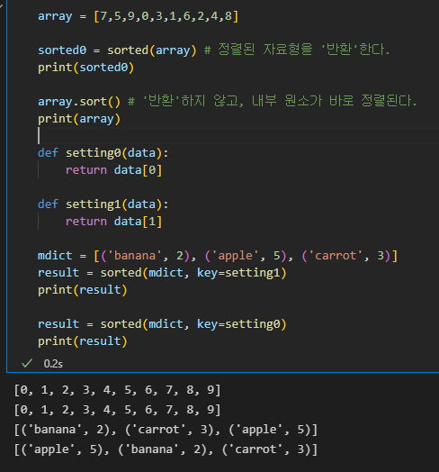

# 정렬이란?
- 정렬이란 데이터를 특정한 기준에 따라 순서대로 나열하는 것을 의미한다.
- 사실 단순히 내용을 정렬하는 것보다 중요한 것은 '이진 탐색'과 '이진 탐색의 전처리'이다.

- 파이썬에서는 주로 '선택 정렬(selection)', '삽입 정렬(insertion)', '퀵 정렬(Quick)', '계수 정렬(Count)'이 사용된다.
- 파이썬에서 제공하는 기본 정렬 라이브러리를 이용하여 좀 더 효과적인 정렬도 수행이 가능하다.

___

## 선택 정렬

- 데이터가 무작위로 여러 개 있을 때, 이 중에서 가장 작은 데이터를 선택해 맨 앞에 있는 데이터와 바꾸고, 
    그 다음으로 작은 데이터를 선택해 앞에서 두 번째 데이터와 바꾸는 과정을 반복하여 수행한다.

    파이썬으로 작성한 소스코드는 아래와 같다.
    ```python
    array = [7,5,9,0,3,1,6,2,4,8]

    for i in range(len(array)):
        min_index = i # 가장 작은 원소의 인덱스
        for j in range(i + 1, len(array)):
            if array[min_index] > array[j]:
                min_index = j
        
        array[i], array[min_index] = array[min_index], array[i] # swap

    print(array)
    ```

    위에서 swap(스와프)란, 간단히 두 변수의 위치를 변경하는 작업을 의미한다.
    따라서, array[i]의 값과 array[min_index]의 값이 바뀐다고 보면 된다.

       
    [실행 결과]

- 선택 정렬의 시간 복잡도는 O(n^2)다.
- 시간 복잡도가 O(n^2)이면 좋지 않다. 시간 복잡도가 O(nlogn)인 퀵 정렬과 비교해보자.

    아래는 각 정렬 방식과 데이터의 개수에 따른 정렬 시간(초)이다.
    |데이터의 개수(N)|선택 정렬|퀵 정렬|기본 정렬 라이브러리|
    |--|--|--|--
    |100|0.0123|0.00156|0.00000753
    |1000|0.354|0.00343|0.0000365
    |10000|15.475|0.0312|0.000248

- 선택 정렬은 정렬로써의 기능보다는, 특정한 리스트에서 가장 작은 데이터를 찾는 일(***주로 코딩테스트에서***)에 사용된다. 

## 삽입 정렬

- 데이터를 하나씩 확인하며, 각 데이터를 적절한 위치에 삽입하는 방식
- 데이터를 '확인'하기 때문에, 정렬이 되어있어도 다 헤집어 놓는 선택 정렬과 다르게 필요할 때만 위치를 바꾸므로 '시간 측면에서 효율적'이다.

    ```python
    array = [7,5,9,0,3,1,6,2,4,8]

    for i in range(1, len(array)): # 두번째 인덱스부터 시작
        for j in range(i, 0, -1): # 인덱스 i부터 앞쪽으로 이동하면서 비교
            if array[j - 1] > array[j]: # 한 칸씩 왼쪽으로 이동
                array[j], array[j - 1] = array[j - 1], array[j] # swap
            else: # 자기보다 작은 데이터를 만나면 그 자리에서 멈춤
                break
        

    print(array)
    ```

       
    [실행 결과]

- 삽입 정렬의 시간 복잡도는 O(n^2)로 선택 정렬과 같지만, ***삽입 정렬은 배열이 정렬되어 있을 때 O(n)라는 복잡도를 가져 매우 빠르게 동작한다는 특징이 있다.***
- 따라서, 거의 정렬되어 있는 상태로 입력이 주어지는 문제라면 삽입 정렬을 이용하는 것이 좋다.

## 퀵 정렬

- 기준 데이터(피벗, pivot)를 설정하고, 그 기준보다 큰 데이터와 작은 데이터의 위치를 바꾸는 형태의 정렬이다.

    ```python
    array = [7,5,9,0,3,1,6,2,4,8]

    def quick_sort(array, start, end):
        if start >= end: # 원소가 1개인 경우, 입력이 잘못 주어진 경우 종료
            return
        pivot = start # 피벗은 첫 번째 원소
        left = start + 1
        right = end # left는 가장 왼쪽, right는 가장 오른쪽에 배치
        while left <= right: 
            # 피벗보다 큰 데이터를 찾을 때까지 반복
            while left <= end and array[left] <= array[pivot]:
                left += 1
            # 피벗보다 작은 데이터를 찾을 때까지 반복
            while right > start and array[right] >= array[pivot]:
                right -= 1
            
            if left > right : # 엇갈렸다면 작은 데이터와 피벗을 교체
                array[right], array[pivot] = array[pivot], array[right]
            else: # 엇갈리지 않았다면 작은 데이터와 큰 데이터를 교체
                array[left], array[right] = array[right], array[left]
        # 분할 이후 왼쪽 부분과 오른쪽 부분에서 각각 정렬 수행
        quick_sort(array, start, right - 1)
        quick_sort(array, right + 1, end)

    quick_sort(array, 0, len(array) - 1)        

    print(array)
    ```
    가장 직관적인 코드이나 너무 길다.
    파이썬의 특징을 활용하여 짧게 작성해보자(시간 면에서 불리하니 참고만 할 것)

    ```python
    array = [7,5,9,0,3,1,6,2,4,8]

    def quick_sort(array):
        if len(array) <= 1: # 원소가 1개인 경우 종료
            return array
        
        pivot = array[0] # 피벗은 첫 번째 원소
        tail = array[1:] # 피벗을 제외한 나머지 부분

        left_side = [x for x in tail if x <= pivot] # pivot보다 작으면 left_side라는 리스트에 들어간다.
        right_side = [x for x in tail if x > pivot] # pivot보다 크면 right_side에 삽입

        return quick_sort(left_side) + [pivot] + quick_sort(right_side)

    quick_sort(array) 

    print(array)
    ```

       
    [실행결과]

    - 퀵 정렬의 평균 시간 복잡도는 O(nlogn)이라 좋으나, ***이미 정렬이 되어 있는 경우***에는 최악의 성능인 O(N^2)을 띄기 때문에 주의해야 한다.

## 계수 정렬

- 계수 정렬은 아무때나 사용할 수는 없고 특정한 조건이 부합할 때만 사용할 수 있지만, 매우 빠른 정렬 알고리즘이다.

- 어떤 조건이냐면, 모든 데이터가 양의 정수이고 개수는 N이고 최댓값이 K일 때, 계수 정렬은 최악의 경우에도 수행 시간 O(N+K)를 보장한다.
- 일반적으로 가장 큰 데이터와 가장 작은 데이터와의 차이가 100만을 넘기지 않을 때 매우 효과적으로 사용이 가능하다(예: 0 이상 100 이하의 성적 데이터를 정렬할 때 매우 유용)

- 계수정렬의 단계는 다음과 같다.
    입력 데이터 예시: 7 5 9 0 3 1 6 2 9 1 4 8 0 5 2 3 5 4 8

    1. 가장 큰 데이터와 가장 작은 데이터의 범위가 모두 담길 수 있도록 하나의 리스트를 생성한다.
    2. 위의 예시에서 최댓값은 9, 최솟값은 0이므로 크기가 10인 리스트를 선언한다.
    3. 그 다음 데이터를 하나씩 확인하며 데이터의 값과 동일한 인덱스의 데이터를 1씩 증가시킨다.

    ```python
    array = [7, 5, 9, 0, 3, 1, 6, 2, 9, 1, 4, 8, 0, 5, 2, 3, 5, 4, 8]

    count = [0] * (max(array) + 1)

    for i in range(len(array)):
        count[array[i]] += 1 # 각 데이터에 해당하는 인덱스의 값 증가

    for i in range(len(count)): # 리스트에 기록된 정렬 정보 확인
        for j in range(count[i]):
            print(i, end=' ') # 띄어쓰기를 구분으로 등장한 횟수만큼 인덱스 출력
    ```

       
    [실행 결과]

- 계수 정렬의 시간 복잡도는 훌륭하나, 공간 복잡도에서 취약점을 가진다.
- 아무때나 쓸 수는 없고, 동일한 값을 가지는 데이터가 여러 개 등장할 때 적합하다.

예시) 데이터가 0과 100, 단 2개만 존재할 때 : ***X***   
예시2) 학생들의 성적(성적 특성상, 동일한 점수를 가진 경우가 많이 나옴)을 정리할 때 : ***O***

## 파이썬의 정렬 라이브러리

- 파이썬은 기본 정렬 라이브러리인 sorted() 함수를 제공한다. 퀵 정렬과 병합 정렬을 섞어 만든 방식으로, 일반적으로 퀵 정렬보다 느리지만 최악의 경우에도 시간 복잡도 O(NlogN)을 보장한다는 특징이 있다.

- sorted는 집합 자료형이나 딕셔너리 자료형을 받는다.
- 리스트의 경우, 리스트 객체의 내장 함수인 sort()를 바로 사용할 수 있다.

```python
array = [7,5,9,0,3,1,6,2,4,8]

sorted0 = sorted(array) # 정렬된 자료형을 '반환'한다.
print(sorted0)

array.sort() # '반환'하지 않고, 내부 원소가 바로 정렬된다.
print(array)

def setting(data):
    return data[1]

mdict = [('banana', 2), ('apple', 5), ('carrot', 3)]
result = sorted(mdict, key=setting)
print(result)
```

   
[실행결과]

- 위에서 튜플 sorted 함수의 key를 지정할 때 함수를 정의했는데, 아래와 같이 lambda를 사용하여 표기해도 된다.

> result = sorted(mdict, key= lambda mydict : mydict[1]) # mdict의 [1]에 해당하는 값들을 리스트로 key 파라미터에 전달해줌

## 정렬 라이브러리의 시간 복잡도

- 정렬 라이브러리는 항상 시간 복잡도 O(NlogN)을 보장해주므로, 굳이 정렬 알고리즘을 구현할 필요 없이 정렬 라이브러리를 쓰는 게 가장 효율적.
- 다만, 코딩 테스트에서 정렬 알고리즘이 사용되는 경우도 있다. 그 경우는 아래와 같다.
1. 정렬 알고리즘의 원리에 대해 물어볼 때
2. 더 빠른 정렬이 필요하여 '계수 정렬'같은 방식이 요구되어 질 때

____

- 지금까지 코딩 테스트에서의 정렬에 대하여 정리하였다.