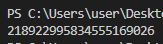
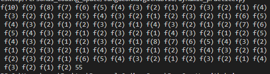
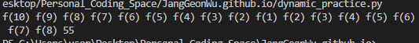
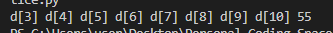
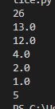
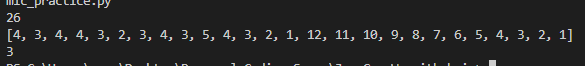
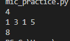

- 다이나믹 프로그래밍은 '한번 계산한 문제는 다시 계산하지 않도록' 하는 알고리즘이다. 다이나믹 프로그래밍에 대해 알아보자.

# 다이나믹 프로그래밍

- 우리는 문제를 풀 때, 연산 속도와 메모리 공간을 최대한으로 활용할 수 있는 효율적인 알고리즘을 작성해야 한다. 이때, 메모리 공간을 약간 더 사용해서 연산 속도를 비약적으로 증가시킬 수 있는 방법이 있다면?  
- 이러한 방법을 다이나믹 프로그래밍(Dynamic Programming) 기법, 즉 동적 계획법이라 한다.

- 동적 계획법에는 '탑 다운(Top-Down)' 방식과 '보텀 업(Bottom-Up)' 방식이 존재한다. 또한, 동적 계획법을 도와주는 '메모이제이션(Memoization)' 기법도 존재한다.

# 다이나믹 프로그래밍, 언제 사용하는가?

- 가장 대표적인 예시로, 피보나치 수열이 있다.

> a[0], a[1] = 1, 1일때,  a[n + 2] = a[n + 1] + a[n]

- 우선, 가장 간단하게 코드를 구현해보자
```python
def fibo(x):
    if x == 1 or x == 2:
        return 1
    return fibo(x-1) + fibo(x-2)
```

- 문제는, 이러한 코드는 O(2^n)의 시간복잡도를 가져, n이 조금만 커져도 시간 초과가 발생하게 된다. 따라서 '다이나믹 프로그래밍'이 필요하다.


___

- 아, 그렇다고 아무때나 다이나믹 프로그래밍을 적용할 수는 없고, 다음 조건을 만족해야 한다.
1. 큰 문제를 작은 문제로 나눌 수 있다.
2. 작은 문제에서 구한 정답은 그것을 포함하는 큰 문제에서도 동일하다.

- 무슨 소리나면, '큰 문제 하나'를 구할 때 '작은 문제 여러 개'를 구하는 방식으로 이루어져야 한다는 소리다.

___
- 위에서 '메모이제이션'을 언급했는데, 이는 말 그대로 '메모'한다는 뜻이며, '캐싱(Caching)'이라고도 부른다.

- 말로만 설명하지 않고, 실제 사용 예시를 보도록 하자.

```python
# 피보나치 수열 99번째 수를 구하여라.
d = [0] * 100 # 한 번 계산된 결과를 메모이제이션하기 위한 리스트 초기화

def fibo(x):
    if x == 1 or x == 2:
        return 1
    if d[x] != 0:
        return d[x] # 이미 계산한 적 있는 문제라면 그대로 반환
    d[x] = fibo(x-1) + fibo(x-2)
    return d[x]

print(fibo(99))    

```
   
[계산값으로, 다이나믹 프로그래밍 없었으면 진짜 엄청난 시간이 걸렸을 수 있었겠다]


- 이렇게 하면 감이 잘 안올 수 있으므로, 각각 어떤 함수를 호출하였는지 비교해보자

```python
# 1. 다이나믹 프로그래밍 없이 구현
def fibo(x):
    print('f(' + str(x) + ')', end=' ')
    if x == 1 or x == 2:
        return 1
    return fibo(x-1) + fibo(x-2)

print(fibo(10))  
```




```python
# 2. 다이나믹 프로그래밍 구현
d = [0] * 100 # 한 번 계산된 결과를 메모이제이션하기 위한 리스트 초기화

def fibo(x):
    print('f(' + str(x) + ')', end=' ')
    if x == 1 or x == 2:
        return 1
    if d[x] != 0:
        return d[x] # 이미 계산한 적 있는 문제라면 그대로 반환
    d[x] = fibo(x-1) + fibo(x-2)
    return d[x]

print(fibo(10))  
```



- 이 결과처럼, 큰 문제를 해결하기 위해 작은 문제를 호출하는 방식을 **탑다운** 형식이라고 한다(10-9-8-....-3-2-1).

- 반대로, 작은 문제부터 차근차근 답을 도출하는 방식을 **바텀업** 형식이라고 한다.

```python
# 3. bottom-up
d = [0] * 100

d[1], d[2] = 1, 1
n = 10

for i in range(3, n + 1):
    print('d['+ str(i)+ ']', end=' ')
    d[i] = d[i - 1] + d[i - 2]

print(d[n])
```



- 위의 코드를 보면 알겠지만, 바텀업에서 배열 d는 '메모이제이션'의 역할과는 거리가 멀다.
- 즉, 메모이제이션은 탑다운 방식에 국한되어 사용되는 표현이다.
- (보텀업 방식에서 사용되는 결과 저장용 리스트는 DP테이블이라 부른다)

___

- 또한, 메모이제이션은 배열-리스트 외에도 'dict' 자료형을 이용할 수도 있다. 언제 쓰냐면, 수열처럼 연속적이지 않을 때 사용한다.

- 일단 다이나믹 프로그래밍 유형을 인지해 두었다가, 만약 특정 문제가 '완전 탐색 알고리즘'으로 안풀릴 때 다이나믹 프로그래밍 적용 여부를 확인해보자.

___

### 추신
- 가능하다면 재귀 함수를 이용하는 탑다운 방식보다는 보텀업 방식으로 구현하는 것을 권장한다.
- 왜냐, 시스템상 재귀 함수의 스택 크기가 한정되어 있을 수 있기 때문인데, 실제로 앞에서 제시한 재귀적 피보나치 수열의 소스코드에서 더 큰 값을 집어넣으면 'recursion depth' 에러가 발생할 수 있다(재귀 함수의 깊이가 너무 깊다는 뜻).
- sys 라이브러리의 setrecursionlimit() 함수로 재귀 제한을 완화할 수 있긴 하지만.... 그냥 보텀업 방식을 사용하도록 하자.

정리 끝!
이제 실습으로 들어가보자.

___

# 실습
### 실습 1
    정수 X가 주어질 때 정수 X에 사용할 수 있는 연산은 다음과 같이 4가지이다.
    1. X가 5로 나누어 떨어지면, 5로 나눈다.
    2. X가 3으로 나누어 떨어지면, 3으로 나눈다.
    3. X가 2로 나누어 떨어지면, 2로 나눈다.
    4. 위의 모든 조건이 해당되지 않으면, 1을 뺀다.

    정수가 주어졌을 때, 연산 4개를 적절히 사용해서 1을 만들려고 한다. 연산을 사용하는 횟수의 최솟값을 출력하시오.

    예를 들어, 정수가 26이면 다음과 같이 계산해서 3번의 연산이 최솟값이다.
    ㄱ. 26 - 1 = 25
    ㄴ. 25 / 5 = 5
    ㄷ. 5 / 5 = 1

- 딱 보기엔 쉬워보인다. 그런데, 막상 짜보면 그렇지는 않을거다.

```python
x = int(input())
i = 0
while x != 1:
    
    if x % 5 == 0:
        x = x / 5
    elif x % 3 == 0:
        x = x / 3
    elif x % 2 == 0:
        x = x / 2
    else:
        x -= 1
    
    print(x)
    i += 1

print(i)
```



- 엥? 이제 이 문제가 왜 다이나믹 프로그래밍 문제인지 알 것이다.
- 앞에서 다이나믹 프로그래밍으로 풀라고 했으니까... 아래와 같이 구현해보자

```python
x = int(input())

d = [100 for _ in range(30000)]

def dp(num, it): # 해당 값을 만드는데 드는 iter보다 작아야 대입 가능
    if num == 1 and d[1] > it: d[1] = it 

    if (num % 5 == 0) and (d[num // 5] > it):
        d[num // 5] = it
        dp(num // 5, it + 1)

    if (num % 3 == 0) and (d[num // 3] > it):
        d[num // 3] = it
        dp(num // 3, it + 1)

    if num % 2 == 0 and (d[num // 2] > it):
        d[num // 2] = it
        dp(num // 2, it + 1)

    if d[num - 1] > it:
        d[num - 1] = it
        dp(num - 1, it + 1)

dp(26, 1)
print(d[:26])
print(d[1])
```



- 이거, 보면 알겠지만, 탑다운이다. 추신에서 '탑다운 말고 바텀업으로 풀어라'라고 했던 것 ㄱ나니?
- 바텀업으로 다시 풀어보자.

```python
x = int(input())

d = [0] * 1000001

for i in range(2, x+1):
    d[i] = d[i - 1] + 1
    if i % 2 == 0:
        d[i] = min(d[i], d[i // 2] + 1)
    if i % 3 == 0:
        d[i] = min(d[i], d[i//3] + 1)
    if i % 5 == 0:
        d[i] = min(d[i], d[i//5] + 1)

print(d[x])  
```

### 문제 2
    개미 전사는 부족한 식량을 충당하고자 메뚜기 마을의 식량창고를 몰래 공격하려고 한다. 메뚜기 마을에는 여러 개의 식량창고가 있는데 식량창고는 일직선으로 이어져있다.
    각 식량창고에는 정해진 수의 식량을 저장하고 있으며 개미 전사는 식량창고를 선택적으로 약탈해 식량을 빼앗을 예정이다.
    이때, 메뚜기 정찰병들은 일직선상에 존재하는 식량창고 중에서 서로 인접한 식량창고가 공격받으면 바로 알아챌 수 있다. 따라서 개미 전사가 정찰병에게 들키지 않고 약탈하기 위해서는 최소한 한 칸 이상 떨어진 식량창고를 약탈해야 한다.

    예: [1, 3, 4, 5]
    이럴 때는 두번째-네번째를 털어야 최대한 많은 식량을 얻을 수 있다.

    예: [1, 3, 9, 5]
    이럴 때는 첫번째-세번째를 털어야 최대한 많은 식량을 얻을 수 있다.

- 이번엔, 다이나믹 바텀업을 제대로 적용해보자.
- 우선, i번째 창고를 털때, i-1번째 창고는 털 수 없다는 점에 주목하자.

```python
x = int(input())

k = list(map(int, input().split()))

d = [0] * (len(k))

for i in range(len(k)):
    if i <= 1:
        d[i] = k[i]
    else:
        d[i] = max(d[:i-1]) + k[i]

print(d[x-1])
```



### 문제 3
    가로의 길이가 N, 세로의 길이가 2인 직사각형 형태의 얇은 바닥이 있다. 태일이는 이 얇은 바닥을 1X2의 덮개, 2X1의 덮개, 2X2의 덮개를 이용해 채우고자 한다.
    이때, 바닥을 채우는 모든 경우의 수를 구하는 프로그램을 작성하시오. 예를 들어 2*3 사이즈의 바닥을 채우는 경우의 수는 5가지이다.

    예: 2 * 3
    case1: 2*2 + 2*1
    case2: (2*1) * 3
    case3: (1*2)*2 + 2*1
    case4: 2*1 + 2*2
    case5: 2*1 + (1*2)*2

- 다이나믹 프로그래밍의 기초 예제로 유명한 타일링 문제 유형이다. 자, 우선 차근차근 생각해보자.

- 2 * (x - 1)의 바닥을 채우는 데 총 A개의 경우의 수가 있다고 하자. 그러면 2 * x의 바닥을 채우려면, 과연 몇개가 드는가?
- 우선, 2*1의 타일을 오른쪽에 붙인다고 해보자. 그러면? 자연스레 A가 된다.
- 2 * (x - 2)의 바닥을 채우는 데 총 B개의 경우의 있다면, 오른쪽에 2*2 타일 하나를 붙이던지 1*2 타일 두개를 붙이면 된다. 즉, 2B가 된다. 2*1은? 위의 A에 포함되니까 고려하지 말자.
- 왼쪽에는 안붙이나요? 예 안붙입니다.

- 그러면, 다음과 같이 코드를 구현할 수 있다.

```python
n = int(input())

d = [0] * (n + 1)
d[0] = 0 # 뭐 없죠?
d[1] = 1 # 2*1 타일 하나만 올 수 있다. 즉 방법은 1가지
d[2] = 3 # 2*2 하나, 2*1 두개, 1*2 두개... 즉 방법은 3가지

for i in range(3, n+1):
    d[i] = (d[i-2] * 2) + d[i-1]

print(d[n])
```

#### 문제 3
    
    N가지 종류의 화폐가 있다. 이 화폐들의 개수를 최소한으로 이용해 그 가치의 합이 M원이 되도록 한다. 이때 각 화폐는 몇개라도 사용할 수 있으며, 사용한 화폐의 구성은 같지만 순서만 다른 것은 같은 경우로 구분한다.
    예시: 2, 3원 동전으로 15원 만들기
    2 15
    2
    3

    -> 3원 4개, 2원 1개

```python
n, m = map(int, input().split())

li = []

it = [100] * (m+1)

for _ in range(n):
    li.append(int(input()))


def dp(num, iterate):
    if num > m:
        pass

    for i in li:
        if num + i <= m:
            it[num + i] = min(it[num + i], iterate + 1)
            dp(num + i, iterate + 1)

dp(0, 0)  
if it[m] == 100: print(-1)
else: print(it[m])
```

___

끗!
