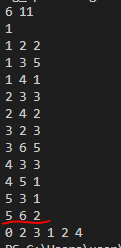
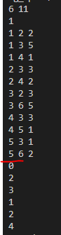
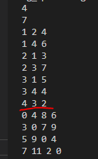

- 특정 지점까지 가장 빠르게 도달하는 방법을 찾는 알고리즘을 구현하여보자.

## 가장 빠른 길 찾기

- 최단 경로 알고리즘은 말 그대로 가장 짧은 경로를 찾는 알고리즘이다.
- 최단 경로 알고리즘 유형에는 다양한 종류가 있는데, 상황에 맞는 효율적인 알고리즘이 대체로 정립되어 있어 유형 파악을 하는 것이 중요하다.


1. 한 지점에서 다른 특정 지점까지의 최단 경로를 구해야 하는 경우
2. 모든 지점에서 다른 모든 지점까지의 최단 경로를 모두 구해야 하는 경우
3. 여러 지점 중 특정 지점까지의 최단 경로가 가장 짧은 지점을 구해야 하는 경우

등등... 이런 사례들에 맞는 알고리즘을 숙지하는 것이 중요하다.

우리는 최단 경로 알고리즘 중에서 가장 중요한 '다익스트라 알고리즘'과 '플로이드 워셜 알고리즘'을 다루고자 한다.
뭐 말은 거창한데, 그리디 알고리즘과 다이나믹 프로그래밍 알고리즘이 합쳐졌다고 봐도 무방하다.

## 다익스트라 최단 경로 알고리즘

- 다익스트라(dijkstra) 알고리즘은, 그래프에서 여러 개의 노드가 있을 때, 특정한 노드에서 출발해 다른 노드로 가는 각각의 최단 경로를 구해주는 알고리즘이다.

기억해두어야 할 것이 있는데, 다익스트라 알고리즘은 '음의 간선(마이너스 경로)'이 없을 때 정상적으로 동작한다. 음의 간선은 실제 환경에서 쓰이지 않아 GPS 소프트웨어의 기본 알고리즘으로 채택되고는 했다.

우선 음의 간선은 나중에 나오니 일단 넘겨두고...

다익스트라 알고리즘은 위에서 잠깐 언급한 '그리디 알고리즘'으로 분류된다. 매번 '가장 비용이 적은 노드'를 선택해 임의의 과정을 반복하기 때문이다.

다음은 알고리즘의 원리에 대하여 간략하게 설명하는 글이다.

1. 출발 노드를 설정한다.
2. 최단 거리 테이블을 초기화한다.
3. 방문하지 않은 노드 중에서 '최단 거리가 가장 짧은' 노드를 선택한다.
4. 해당 노드를 거쳐 다른 노드로 가는 비용을 계산하여 최단 거리 테이블을 갱신한다.
5. 위의 과정에서 **3번**과 **4번**을 반복한다.

다익스트라 알고리즘은 최단 경로를 구하는 과정에서, 각 노드에 대한 현재까지의 최단 거리 정보를 항상 1차원 리스트에 저장하며, 리스트를 계속 갱신해 나간다는 특징이 있다.

매번 현재 처리하고 있는 노드를 기준으로 주변 간선을 확인한다.

### 다익스트라 알고리즘 구현 방법

그러면 단순하게 설계할 수 있겠네!...라고 생각했다면 진정하길 바란다.   
다익스트라 알고리즘을 구현하는 방법은 2가지이니 말이다.

1. 구현하기 쉽지만 느리게 동작하는 코드
2. 구현하기에 조금 더 까다롭지만 빠르게 동작하는 코드

그리고, 당연하다시피, 우리는 2번째 방법을 숙달해야 한다.

___

우선, 다익스트라 알고리즘의 기본 구조를 보자.

```python
import sys
input = sys.stdin.readline
INF = int(1e9) # 매우매우 큰 수, 무한을 의미하며 '없는 경로'를 의미한다.
# 노드의 개수, 간선의 개수 입력받기
n, m = map(int, input().split())
# 시작 노드 번호를 입력받기
start = int(input())
# 각 노드에 연결되어 있는 노드에 대한 정보를 담는 리스트를 만들기
graph = [[] for i in range(n+1)]
# 방문한 적이 있는 지 체크하는 목적의 리스트 만들기
visited = [False] * (n + 1)
# 최단 거리 테이블을 모두 무한으로 초기화
distance = [INF] * (n + 1)

# 모든 간선 정보를 입력받기
for _ in range(m):
    # a 노드에서 b 노드로 가는 비용이 c라는 의미
    a, b, c = map(int, input().split())
    graph[a].append((b, c))

# 방문하지 않는 노드 중에서, 가장 최단 거리가 짧은 노드의 번호
def get_smallest_node():    
    min_value = INF
    index = 0
    for i in range(1, n+1):
        if distance[i] < min_value and not visited[i]:
            min_value = distance[i]
            index = i
    return index

def dijkstra(start):
    distance[start] = 0 # 시작 노드에 대해 초기화
    visited[start] = True
    for j in graph[start]:
        distance[j[0]] = j[1]
    # 시작 노드를 제외한 전체 n - 1개의 노드에 대해 반복
    for i in range(n - 1):
        # 현재 최단 거리가 가장 짧은 노드를 꺼내서, 방문 처리
        now = get_smallest_node()
        visited[now] = True
        # 현재 노드와 연결된 다른 노드를 확인
        for j in graph[now]:
            cost = distance[now] + j[1]
            # 현재 노드를 거쳐 다른 노드로 이동하는 거리가 더 짧은 경우
            if cost < distance[j[0]]:
                distance[j[0]] = cost

dijkstra(start)

# 모든 노드로 가기 위한 최단 거리를 출력
for i in range(1, n+1):
    # 도달할 수 없는 경우, 무한(INF)이라고 출력
    if distance[i] == INF:
        print('INFINITY')
    else:
        print(distance[i])

```



- 붉은 선 위쪽이 입력값, 아래쪽이 출력값

- 이게 간단하냐!는 이야기가 나오겠지만, 이것 조차도 시간 복잡도가 O(n^2)라 노드의 개수가 5000개가 넘어가면 사실상 사용 불가능하다.
- 그러니, 우리는 '개선된 다익스트라 알고리즘'만 알고 있으면 된다.

___

일단 코드부터 보기 전에, 개선된 다익스트라 알고리즘에서는 'Heap(힙)' 자료구조를 사용한다는 것을 알아야 한다.   
힙 자료구조는 '우선순위 큐'를 구현하기 위해 사용하는 자료구조 중 하나로, *우선순위 큐*는 우선순위가 가장 높은 데이터를 가장 먼저 삭제하는 큐를 의미한다.

즉, 우선순의 큐는 데이터를 '우선 순위'에 따라 처리하고 싶을 때 사용한다.

파이썬에서는 우선순위 큐가 필요할 때 PriorityQueue 혹은 heapq를 사용하는데, 보통 heapq가 더 빠르니까 heapq 쓰면 된다.

우선순위 값을 표현할 때는 '일반적으로 정수형 자료형의 변수'가 쓰인다. 무슨 소리냐고? 그냥 숫자 쓴다는 뜻이다.
이러한 우선순위는 '최대 힙'또는 '최소 힙'으로 나뉘는데, 값 낮은거랑 높은거 중 뭐가 우선순위 높은 지 판단하는 거다.

... 잡설이 길었다, 바로 코드를 보도록 하자.

```python
import heapq
import sys
input = sys.stdin.readline
INF = int(1e9)

# 노드의 개수, 간선의 개수를 입력받기
n, m = map(int, input().split())
# 시작 노드 번호를 입력받기
start = int(input())
# 각 노드에 연결되어 있는 노드에 대한 정보를 담는 리스트를 만들기
graph = [[] for i in range(n+1)]
# 방문한 적이 있는 지 체크하는 목적의 리스트 만들기
visited = [False] * (n + 1)
# 최단 거리 테이블을 모두 무한으로 초기화
distance = [INF] * (n + 1)

# 모든 간선 정보를 입력받기
for _ in range(m):
    # a 노드에서 b 노드로 가는 비용이 c라는 의미
    a, b, c = map(int, input().split())
    graph[a].append((b, c))

def dijkstra(start):
    q = [] # '큐' 역할을 수행할 리스트
    # 시작 노드로 가기 위한 최단 경로는 0으로 설정, 큐q에 삽입
    heapq.heappush(q, (0, start))    
    distance[start] = 0 # 출발 지점은 거리가 0
    while q: # 큐가 비어있지 않다면
        # 가장 최단 거리가 짧은 노드에 대한 정보 꺼내기
        dist, now = heapq.heappop(q)
        # 현재 노드가 이미 처리된 적이 있는 노드(거리가 더 짧은 루트가 있음)라면 무시
        if distance[now] < dist:
            continue
        # 현재 노드와 연결된 다른 인접한 노드들을 확인
        for i in graph[now]:
            cost = dist + i[1]
            # 현재 노드를 거쳐서, 다른 노드로 이동하는 거리가 더 짧은 경우
            if cost < distance[i[0]]:
                distance[i[0]] = cost
                heapq.heappush(q, (cost, i[0]))

dijkstra(start)

# 모든 노드로 가기 위한 최단 거리를 출력
for i in range(1, n+1):
    # 도달할 수 없는 경우, 무한(INF)이라고 출력
    if distance[i] == INF:
        print('INFINITY')
    else:
        print(distance[i])
```



___

### dijkstra algorithm 정리!

1. 힙을 안쓰면 O(n^2), 힙을 쓰면 O(nlogn)
2. 튜플의 첫 번째 원소인 '거리'정보를 기준으로 해서 우선순위 큐를 구성하므로, 거리가 짧은 원소가 항상 먼저 나온다.
3. 다익스트라 (힙 사용) 알고리즘은 다른 문제(예: 최소 신장 트리 문제 풀이를 위한 Prim 알고리즘)와 유사하므로, 잘 숙지하도록 하자.


___

## 플로이드 워셜 알고리즘

- 플로이드 워셜 알고리즘은, 모든 지점에서 다른 모든 지점까지의 최단 경로를 모두 구해야 하는 경우에 사용하는 알고리즘이다.

플로이드 워셜 알고리즘은, 알고리즘 단계마다 '거쳐 가는 노드'를 기준으로 수행한다는 점이 특징이다. 이때문에 시간 복잡도가 O(n^3)이라는 특징이 있다.

다익스트라 알고리즘은 주로 그리디 프로그래밍에 가깝고, 플로이드 워셜 알고리즘은 다이나믹 프로그래밍에 가깝다.

플로이드 워셜 알고리즘의 틀은 대략적으로 아래와 같다.

> D_ab = min(D_ab, D_ak + D_kb)

즉, '기존에 찾은 경로'와 '새로 찾은 경로' 중 작은걸 구하는거다.

뭐, 백문이 불여일타, 한번 코드를 입력하면서 이해해보자.

```python
INF = int(1e9)

# 노드의 개수 및 간선의 개수 입력받기
n = int(input())
m = int(input())
# 2차원 리스트(노드 개수 * 노드 개수) 만들고, INF로 초기화
graph = [[INT] * (n + 1) for _ in range(n + 1)]

# 자기 자신에서 자기 자신으로 가는 비용은 0으로 초기화
for a in range(1, n+1):
    graph[a][a] = 0

# 각 간선에 대한 정보를 입력받아, 그 정보를 초기화
for _ in range(m):
    a, b, c = map(int, input().split())
    graph[a][b] = c

# 점화식에 따라 플로이드 워셜 알고리즘을 수행
for k in range(1, n+1):
    for a in range(1, n+1):
        for b in range(1, n+1):
            graph[a][b] = min(graph[a][b], graph[a][k] + graph[k][b])    

for a in range(1, n+1):
    for b in range(1, n+1):
        if graph[a][b] == INF:
            print("INF", end=' ')
        else:
            print(graph[a][b], end=' ')

    print() # 줄바꿈
```



- 응용하기 전까지는 감이 잘 안 올 것이다. 문제를 풀며 다익스트라-플로이드를 이해해보자.

___

# 실습

## 문제 1
    첫째 줄에 전체 노드의 개수 N과 경로의 개수 M이 공백으로 구분되어 차례대로 주어진다. 이후 둘째 줄부터 M + 1번째 줄에는 연결된 두 회사의 번호가 공백으로 구분되어 주어진다.
    그 다음 줄부터는 도착점(X), 경유점(K)이 주어진다. 단, 시작점은 무조건 1이다.

    예를 들어, 경로가 아래와 같다고 가정하자.
    > (1-2), (1-3), (1-4), (2-4), (3-4), (3-5), (4-5)

    X = 4, K = 5라면, 1 -> 4 -> 5 -> 4라서, 최소 이동 시간 3을 출력하면 된다. 만약 회사에 도달이 불가능하면 -1을 출력하면 된다.

- 이 문제는 전형적인 플로이드-워셜 알고리즘이다. 간단하게 풀어보자.

```python
INF = int(1e9)

n, m = map(int,input().split())
graph = [[INF] * (n + 1) for _ in range(n + 1)]

for _ in range(m):
    a, b = map(int, input().split())
    graph[a][b] = 1
    graph[b][a] = 1

# 자기 자신에서 자기 자신으로 가는 비용은 0으로 초기화
for a in range(1, n+1):
    graph[a][a] = 0


for k in range(1, n+1):     
    for a in range(1, n+1):
        for b in range(1, n+1):
            graph[a][b] = min(graph[a][b], graph[a][k] + graph[k][b])

x, k = map(int, input().split())            

cost = graph[1][k] + graph[k][x]

if cost >= INF:
    print(-1)
else:
    print(cost) 
```

## 문제2
    첫째 줄에 노드의 개수 N, 간선의 개수 M, 메시지를 보내고자 하는 노드 C가 주어진다. 이후 M+1번째 줄까지 간선에 대한 정보가 주어지는데, 출발점(X)에서 도착점(Y)까지의 거리(Z)를 의미한다. 거리는 방향과 상관 없다.

    노드 C에서는 최대한 많은 노드에 메시지를 전하고자 한다.
    이때, 메시지를 받는 노드의 개수와 총 거리를 구하시오.
    
    예)
    3 2 1
    1 2 4
    1 3 2

    2 4

- 위에서는 플로이드 알고리즘을 사용했으니, 해당 알고리즘은 다익스트라 알고리즘일 것이다.

```python
import heapq
import sys
input = sys.stdin.readline
INF = int(1e9)

# 노드의 개수, 간선의 개수를 입력받기
n, m, c = map(int, input().split())
# 각 노드에 연결되어 있는 노드에 대한 정보를 담는 리스트를 만들기
graph = [[] for i in range(n+1)]
# 방문한 적이 있는 지 체크하는 목적의 리스트 만들기
visited = [False] * (n + 1)
# 최단 거리 테이블을 모두 무한으로 초기화
distance = [INF] * (n + 1)

# 모든 간선 정보를 입력받기
for _ in range(m):
    x, y, z = map(int, input().split())
    graph[x].append((y, z))
    graph[y].append((x, z))

def dijkstra(c):
    q = [] # '큐' 역할을 수행할 리스트
    # 시작 노드로 가기 위한 최단 경로는 0으로 설정, 큐에 삽입
    heapq.heappush(q, (0, c))    
    distance[c] = 0
    while q: # 큐가 비어있지 않다면
        # 가장 최단 거리가 짧은 노드에 대한 정보 꺼내기
        dist, now = heapq.heappop(q)
        # 현재 노드가 이미 처리된 적이 있는 노드라면 무시
        if distance[now] < dist:
            continue
        # 현재 노드와 연결된 다른 인접한 노드들을 확인
        for i in graph[now]:
            cost = dist + i[1]
            # 현재 노드를 거쳐서, 다른 노드로 이동하는 거리가 더 짧은 경우
            if cost < distance[i[0]]:
                distance[i[0]] = cost
                heapq.heappush(q, (cost, i[0]))    

dijkstra(c)       

cnt = -1 # 본인 제외
max_num = 0
for i in range(1, n+1):
    if distance[i] != INF:
        cnt += 1
        max_num = max(max_num, distance[i])

print(cnt, max_num)
```

___

이것으로 최단 경로 알고리즘을 마친다.